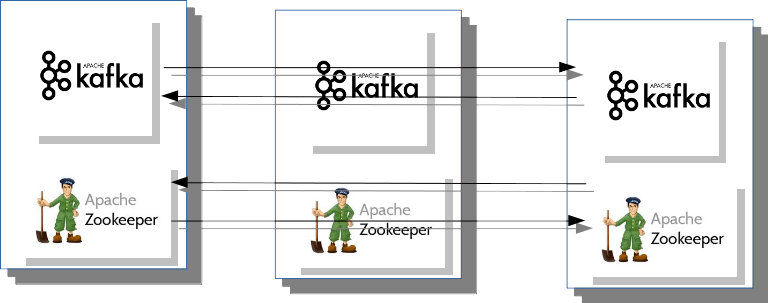
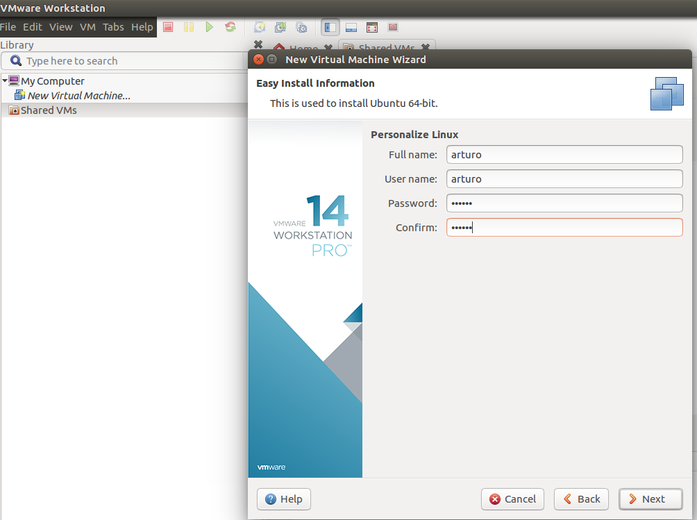
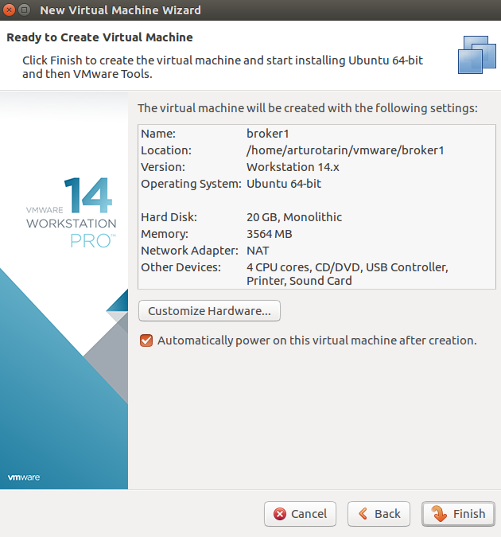
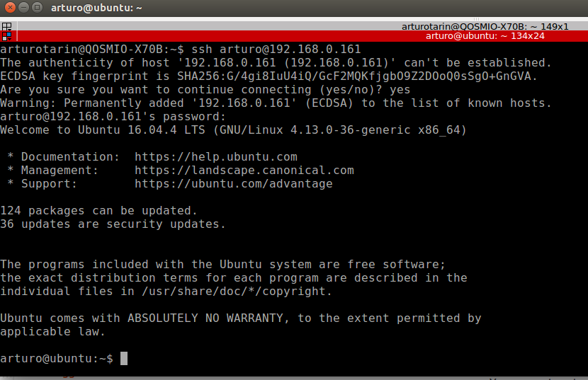

## Deploying a production-ready Kafka cluster with Ansible
------------------------------------------------------------------------------

- Requires Ansible 1.2
- Expects Ubuntu 16.04 hosts

### Document objective
---------------------------------------------

The present document is a guide to build a three node Kafka cluster machine,
build on top of three Ubuntu 16.04 VMWare virtual machines.

We will use then this environment to run performance and fail tolerance tests,
producing XML message workloads into a Kafka topic, and replicating these messages
to a topic in a Google Cloud Kafka cluster.


### Kafka cluster architecture
------------------------------------

Three node cluster with Zookeeper and Kafka clusters installed and configured:



### Deploy the Kafka cluster in local VMWare Workstation machines
-----------------------------------------------------------------------

Create one Ubuntu virtual machine:



i.e.

username: arturo
password: arturo



#### Enable SSHing into this machine installing a DHCP server with this bash command:
-------------------------------------------------------------------------------------

```bash
$ sudo apt-get install openssh-server
```


Now we will be able to ssh into this machine from a machine in the same domain:



#### Install Ansible into this node:
-----------------------------------------------------------------------

```bash
$ sudo apt-get install ansible
```

#### Clone the Ubuntu machine
-----------------------------------------------------------------------


Login into the three virtual machines. Name them broker1, broker2 and broker3 in the /etc/hostname file:

```bash
arturo@broker1:~$ sudo vi /etc/hostname
broker1

arturo@broker2:~$ sudo vi /etc/hostname
broker2

arturo@broker3:~$ sudo vi /etc/hostname
broker3

```

#### Make their IPs static and add them to /etc/hosts
-----------------------------------------------------------------------

make their IPs static:

```bash
arturo@broker1:~$ sudo vi /etc/network/interfaces
auto lo
iface lo inet loopback
auto ens33
iface ens33 inet static
address 192.168.0.116
netmask 255.255.255.0
gateway 192.168.0.1
dns-nameservers 8.8.8.8 192.168.0.1

arturo@broker1:~$ sudo reboot now

arturo@broker2:~$ sudo vi /etc/network/interfaces
auto lo
iface lo inet loopback
auto ens33
iface ens33 inet static
address 192.168.0.117
netmask 255.255.255.0
gateway 192.168.0.1
dns-nameservers 8.8.8.8 192.168.0.1

arturo@broker2:~$ sudo reboot now

arturo@broker3:~$ sudo vi /etc/network/interfaces
auto lo
iface lo inet loopback
auto ens33
iface ens33 inet static
address 192.168.0.118
netmask 255.255.255.0
gateway 192.168.0.1
dns-nameservers 8.8.8.8 192.168.0.1

arturo@broker3:~$ sudo reboot now
```

Add their references into the /etc/hosts:

```bash
arturo@broker1:~$ cat /etc/hosts
127.0.0.1	localhost
127.0.1.1	ubuntu
192.168.0.116   broker1
192.168.0.117   broker2
192.168.0.118   broker3

arturo@broker2:~$ cat /etc/hosts
127.0.0.1	localhost
127.0.1.1	ubuntu
192.168.0.116   broker1
192.168.0.117   broker2
192.168.0.118   broker3

arturo@broker3:~$ cat /etc/hosts
127.0.0.1	localhost
127.0.1.1	ubuntu
192.168.0.116   broker1
192.168.0.117   broker2
192.168.0.118   broker3

```

### Deployment Example

The inventory file looks as follows:

```bash
[broker1]
192.168.0.116 ansible_ssh_user=arturo
[broker2]
192.168.0.117 ansible_ssh_user=arturo
[broker3]
192.168.0.118 ansible_ssh_user=arturo
```

Build the site with the following command:

```bash
$ ansible-playbook kafka.yml --ask-sudo-pass -k --become --become-method=sudo
```


#### Verifying the Deployment 
---------------------------------------------

Once configuration and deployment has completed we can check our local kafka cluster
availability by connecting to any individual node of the Kafka cluster and create
a topic from one node, check the topic from other, produce some messages from one
node into the topic and consume them from the rest of the nodes, i.e.:

```bash
arturo@broker1:/opt/kafka$ bin/kafka-topics.sh --create --zookeeper broker1:2181,broker2:2181,broker3:2181 --replication-factor 3 --partitions 3 --topic test
Created topic "test".

arturo@broker2:/opt/kafka$ bin/kafka-topics.sh --describe --zookeeper broker1:2181,broker2:2181,broker3:2181 --topic test
Topic:test	PartitionCount:3	ReplicationFactor:3	Configs:
	Topic: test	Partition: 0	Leader: 3	Replicas: 3,1,2	Isr: 2,3
	Topic: test	Partition: 1	Leader: 2	Replicas: 1,2,3	Isr: 2,3
	Topic: test	Partition: 2	Leader: 2	Replicas: 2,3,1	Isr: 2,3

arturo@broker3:/opt/kafka$ bin/kafka-topics.sh --list --zookeeper broker1:2181,broker2:2181,broker3:2181
test


arturo@broker1:/opt/kafka$ bin/kafka-console-producer.sh --broker-list broker1:9092,broker2:9092,broker3:9092 --topic test
>mensaje1
mensaje2
mensaje3

arturo@broker2:/opt/kafka$ bin/kafka-console-consumer.sh --bootstrap-server broker1:9092,broker2:9092,broker3:9092 --topic test –from-beginning
mensaje1
mensaje2
mensaje3

arturo@broker3:/opt/kafka$ bin/kafka-console-consumer.sh --bootstrap-server broker1:9092,broker2:9092,broker3:9092 --topic test –from-beginning
mensaje1
mensaje2
mensaje3
```
